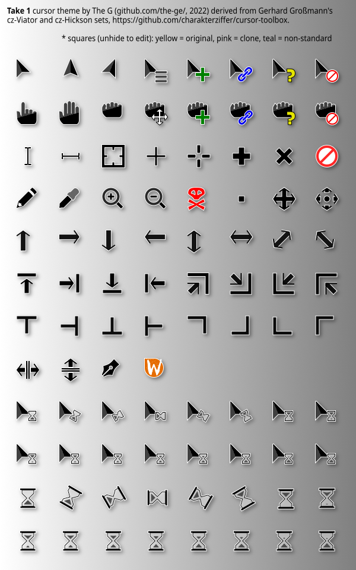
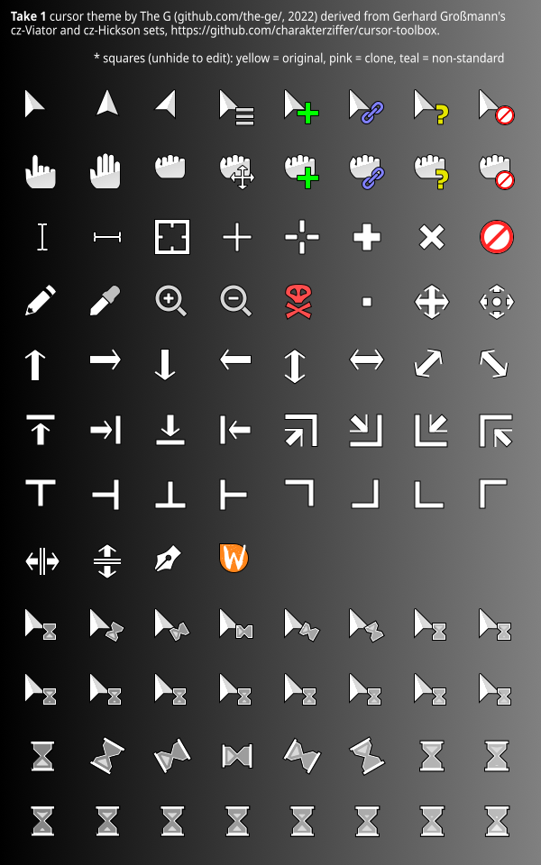

# The G's Cursor Theme Generator

This collection of files enables you to create a Linux (at least for now :D ) cursor theme out of an SVG file. I used it to build my Take 1 cursor theme (original, IKR), included in this package. The script is heavily inspired by Gerhard Großmann's (@charakterziffer) [Toolbox for X11 Mouse Cursors](https://github.com/charakterziffer/cursor-toolbox). While this was intended to be just an updated fork, it changed way too much for that.





Maybe you want to just download the generated themes and install them:
- [Take 1 theme zipped](export/Take-1_2022.08.11.205849.zip)
- [Take 1 Shadowed theme zipped](export/Take-1-Shadowed_2022.08.11.210307.zip)
- [Take 1 White theme zipped](export/Take-1-White_2022.08.11.205447.zip).

For installation, at least for now, I'll defer you to the [Gerhard's GitHub page](https://github.com/charakterziffer/cursor-toolbox#install).

## Requirements

* [**Python 3.10**](https://www.python.org/): While 3.9 or 3.8 could work, I wouldn't know, didn't try.
* [**Inkscape**](https://inkscape.org/): I used the [1.2.1 version AppImage](https://inkscape.org/release/inkscape-1.2.1/gnulinux/appimage/). Again, older versions may interfere with this script. Or may not. Who knows ¯\_(ツ)_/¯ ?
* **xcursorgen**: is a tool that allows for creation of cursor files from PNG files. Ubuntu 22.04 has it in the x11-apps package, I don't remember if it was already installed.

## How to use this generator

Clone or download the files of this repository to your local machine. If you downloaded it via the top right green github button then unpack the zip file. The cleanest way would be to move the script into a [Python virtual environment](https://realpython.com/python-virtual-environments-a-primer/), which will keep everything in the work folder. Not a requirement, though.

The core of my script is the SVG theme file. I contains the same three layers as Gerhard's toolbox, named *cursors*, *shadows*, *slices*, with the same roles: *cursors* contains the graphics, *shadows* contains.. oh, well, the shadows, and it can be hidden to generate the shadowless version. A *background* layer which only helps visualising cursors was added.

The *slices* layer is the most important because it contains the corresponding cursor name as its ID, which Inkscape will use to name the sliced rectangles to be exported as intermediary PNGs. In addition to that, and that's the biggest change from Gerhard's script, the *slices* layer also contains the hostspots and symlinks information, as custom attributes of the rectangles inside it.

When you run it, the script makes a copy of the theme SVG in the *build* folder. Inkscape will generate from it intermediary PNGs in the *build* folder for every rectangle in the *slices* layer and will return the hotspots and symlinks information to the script. The script will use that information to generate (again in the *build* folder) the configuration files for xcursorgen, which in turn will use those together with the PNGs to generate the final cursor files. The symlinks information will be used by the script to create the symlinks required by the odd apps.

In the end, the final structure of the theme, containing the cursors and the symlinks, together with the *cursor.theme* and *index.theme* files is created in the *dist* folder, in a folder named after the theme and the time of generation. If there are multiple SVG files in the *themes* folder, the script will loop over them and create a cursor theme from each one.

### 1 Designing Your Own Cursors

You could jump directly the theme generation, but the themes are already available for download, so not much use in skipping the design phase. Which means:
1. Open the theme SVG in Inkscape; the SVG's name will become the theme name (as in *Take 1*, note the space). It will also become the theme folder name, after replacing the non-alphanumeric characters with dashes (i.e. *Take-1*').
2. Modify or design the cursors. A good Inkscape command comes in handy now.
3. Remember to save often.
4. Unhide the *slices* layer and note the hotspot coordinates as differences in pixels from the top-left rectangle corner.
5. Open the XML editor of Inkscape (Ctrl + Shift + X) and select the corresponding rectangle.
6. Add or open the 'hotspot' custom attribute (the name is hard-coded, don't change it). Fill it with the value noted before (i.e. *1 1*, numbers separated by a space). The script will calculate the hospot for the other cursor sizes.
7. Did I mentioned you need to save often?
6. If you need to add/edit/remove a symlink, add or open the 'symlinks' custom attribute. Its name is also hard-coded, so don't change it.
8. For the shadows, there are much knowledgeable people than me. I cloned the shapes in *cursors* to the *shadows* folder and I used the *Shadows and Glows* Inkscape filter on them. And it was plenty for me.
9. Also, remember to save often.
10. Hide the layers you don't need: *slices*, *background*, and depending on your theme, *shadows*
11. Finally, you can save :D .

### 2 Generating the Theme

If you edited the theme SVG file, make sure the layer *slices* is invisible.

Then open a terminal and navigate to the folder where you unzipped or cloned the script. The only script to run is *src/main.py*, which is conveniently symlinked in the script root. The launch command is

```Bash
./make.py
```

Arguments can be provided for:
- sizes (*-s* or *--sizes*).
- a prefix to be prepended to each cursor name (*-p* or *--prefix*). I didn't see its use case, but Gerhard had it, so I let it stay.
- a debug switch (*-d* or *--debug*). When it is present the script will display a lot of details of its activities.
- a switch for keeping the temporary files in the *build* folder, if you might want to examine them.

A command using all parameters would be:

```Bash
./make.py -dk -p 'something-in-front-of-names' -s '24 36 48'
```

or

```Bash
./make.py --debug --keep-tmp --prefix='something-in-front-of-names' --size='24 36 48'
```

The default sizes are '24 32 48 64 96 128' (space-separated numbers). So, if you run the script without arguments as in the first command, you'll get all those dimensions, a nice progress bar, but no debug messages, no prefix and no temporary files. I kept only 22 and 24 for my desktop cursor theme, while having all of them for the themes available here. 24 is the base for all the calculations, so be sure to have it all the time. Note to self: I should probably have the script enforce the presence of the 24 size.

This creates first a *build* folder, then, when Inkscape finishes exporting all the intermediary PNGs, the script creates a *dist* folder to contain the final cursor themes, one for each SVG in the *themes* folder. The first phase (Inkscape processing) will take a **long** time. However, it does a much better and faster job than *ImageMagick* with *rsvg*, at least for me. As an example, generating the three cursor themes with all dimensions above took 13 minutes on a i3 with 16GB RAM.

## Technical notes

The main changes from Gerhard Großmann's (@charakterziffer) [Toolbox for X11 Mouse Cursors](https://github.com/charakterziffer/cursor-toolbox) would be:
1. moved all the logic inside Python scripting
2. there is only one command to do all the processing
3. multiple theme can be generated by simply placing appropriately named and edited SVGs in the *themes* folder
4. some multi-threading is used, which shaved the time needed almost to half

---

If you have further questions, ideas or need some help with my cursor toolbox I’m more than happy to give a hand. Please file an issue here at GitHub or simply [mail me](_dev2022@tenita.eu) and we’ll figure that out 😀.
